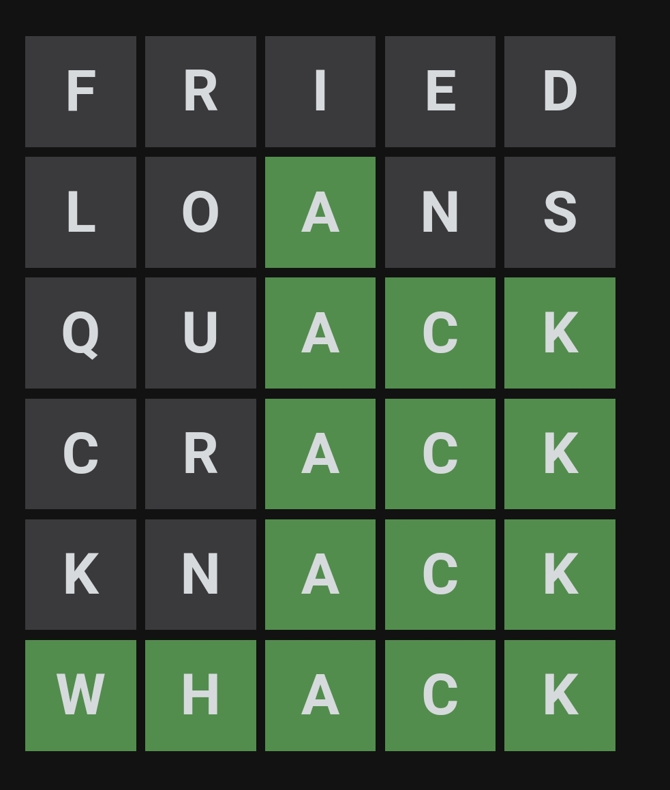
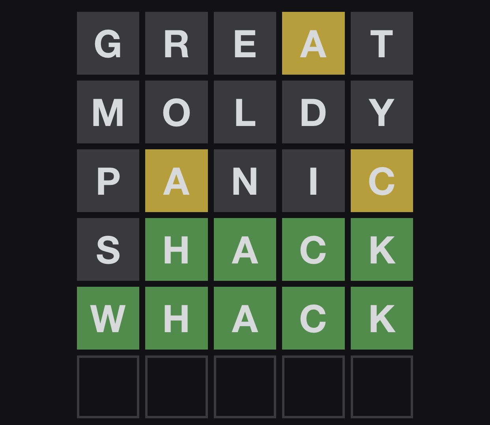

# Word list generation

Downloaded words_alpha.txt from https://github.com/dwyl/english-words

Extracted all five letter words from the `words_alpha.txt` file using (file contains carriage returns, so have to account for that):

> cat words_alpha.txt | grep '^.....\r$' > five_letter_words.txt

Now generate a Solr JSON data file:

> ruby solr_doc_gen.rb > solr_docs.json

# Solr

Start Solr and create a `words` collection:

> bin/solr create -c words

# Examples

## Example 1: some bad human guesses that could have been prevented

After the initial `FRIED` guess, we know none of those letters are in the answer.  Let's ask Solr how many words there are without those letters:

http://localhost:8983/solr/words/select?q=*:*&fq=-{!terms f=letters_ss}f,r,i,e,d

Let's guess another word, from that list of over 3000 words remaining, of `LOANS`.  Wordle gives us the green light on the third letter `A`.  Using this new information, that none of the letters other than the `A` is present, we narrow the list down further:

http://localhost:8983/solr/words/select?q=*:*&fq=-{!terms f=letters_ss}f,r,i,e,d,l,o,n,s&fq=letter3_s:a&fl=id&rows=9999

We're down to 69 words.  Let's guess again from that list, `QUACK`.  We can now eliminate words with `Q` and `U`, and know that the last two letters are `CK`.   Using this info, we can query Solr to see what's left:

http://localhost:8983/solr/words/select?q=*:*&fq=-{!terms f=letters_ss}f,r,i,e,d,l,o,n,s,q,u&fq=letter3_s:a&fq:letter4_s:c&fq=letter5_s:k&fl=id,*&rows=9999

There's now 6 words left: `aback`, `chack`, `chawk`, `kyack`, `thack`, and `whack`

You can see in the example that `CRACK` was a bad next choice as `R` was already marked off, and really only two of those words are reasonably common (`aback` and `whack`).  `KNACK` was also a bad choice too, as `N` was already marked off.

## Example 2

Let's make a `GREAT` guess.  We learn that there's an `A` somewhere other than the fourth letter, and that the other letters are not present in the answer.  Let's ask Solr what words are left:

http://localhost:8983/solr/words/select?q=*:*&fq=-{!terms f=letters_ss}g,r,e,t&fq:-letter4_s:a&fq={!terms f=letters_ss}a&fl=id,*&rows=9999

That leaves us with over 2300 words.  Next guess is `MOLDY`, with no letter matches.  Using that new exclusion information, we query Solr:

http://localhost:8983/solr/words/select?q=*:*&fq=-{!terms f=letters_ss}g,r,e,t,m,o,l,d,y&fq:-letter4_s:a&fq={!terms f=letters_ss}a&fl=id&rows=9999&wt=csv

Still a lot of words left to consider, over 500.  We next guess `PANIC`, giving us one additional known letter (but not its position, other than not the fifth one) and a few more letters to exclude.  What's Solr say is left?

http://localhost:8983/solr/words/select?q=*:*&fq=-{!terms%20f=letters_ss}g,r,e,t,m,o,l,d,y,p,n,i&fq:-letter4_s:a&fq=letters_ss:(a%20AND%20c)&fl=id&rows=9999&xwt=csv

Down to 54 words left.  We guess `SHACK` which gets us a lot warmer!  The last four letters are now known, and there's no `S`.  Solr narrows it down to these words:

http://localhost:8983/solr/words/select?q=*:*&fq=-{!terms%20f=letters_ss}g,r,e,t,m,o,l,d,y,p,n,i,s&fq:-letter4_s:a&fq=letters_ss:(a%20AND%20c)&fq=letter2_s:h&fq=letter3_s:a&fq=letter4_s:c&letter5_s:k&fl=id&rows=9999&wt=csv

Only `chack` and `whack` are left, and is `chack` even a real word?!   

`WHACK` it is!

