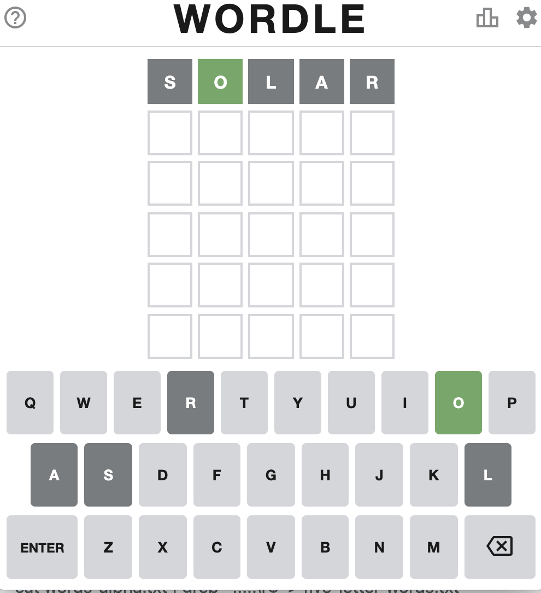
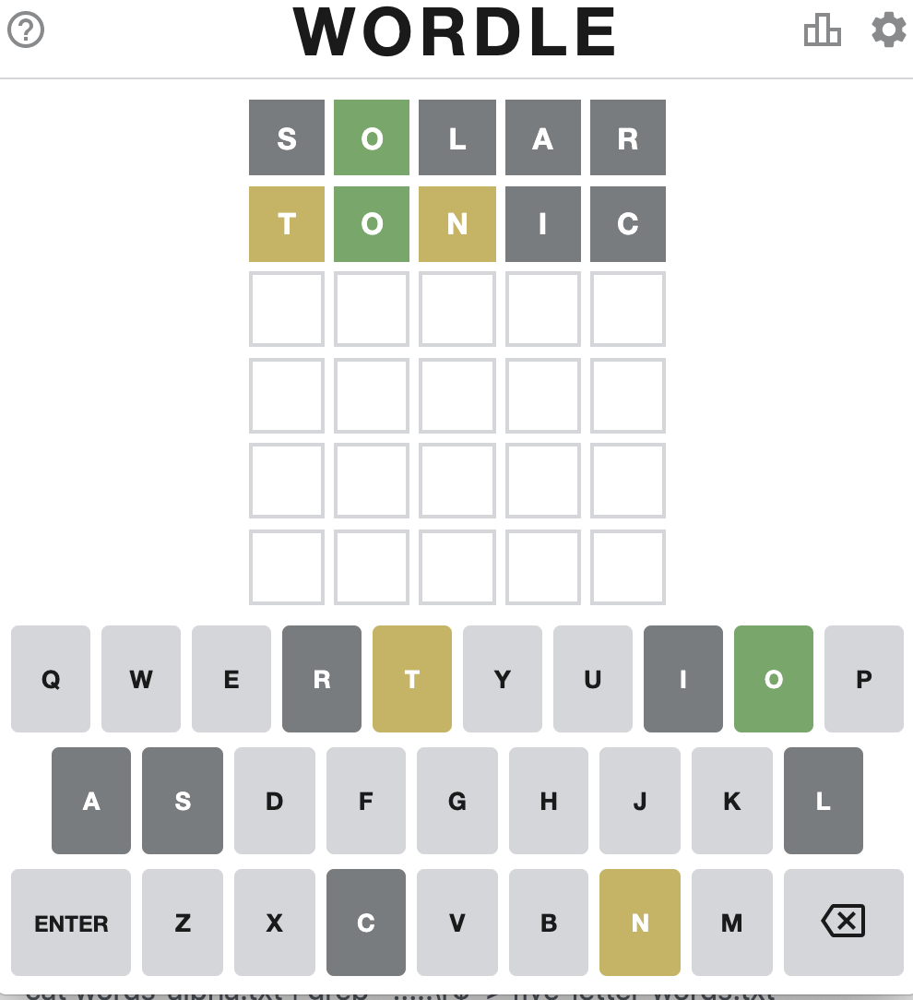
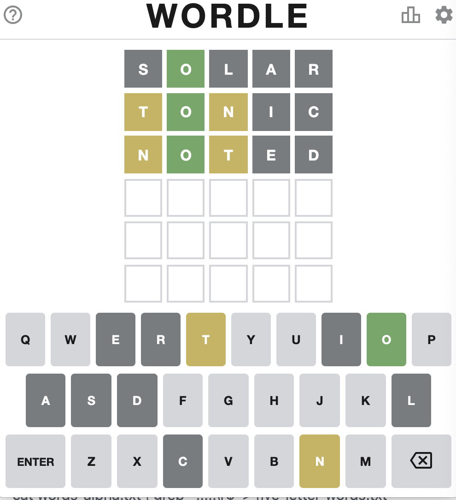
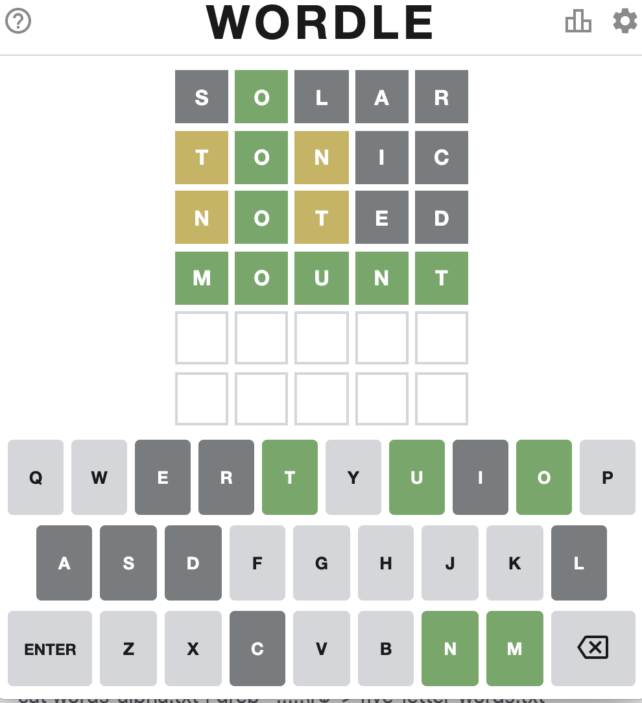

# Solrdle

Solr powered Wordle guesser.  "so lord uhl"

## Solr

Start Solr and create a `words` collection:

> bin/solr create -c words

## Building the dictionary

  * Download words_alpha.txt from https://github.com/dwyl/english-words

  * Extracted all five letter words from the `words_alpha.txt` file using (file contains carriage returns, so have to account for that):

> cat words_alpha.txt | grep '^.....\r$' > five_letter_words.txt

  * Now generate a Solr JSON data file:

> ruby solr_doc_gen.rb > solr_docs.json

  * Index the five letter words into Solr:

> bin/post -c words ~/dev/solrdle/solr_docs.json 

## Examples

### Example 1: SOLAR TONIC

We start with the word `SOLAR`:

We now know that the second letter is `O` and that none of the letters `S`, `L`, `A`, nor `R` are in the solution.  Using this information, we query Solr using these these filters:

* `-({!terms f=letters_ss v=$exclude_letters})`
* `letter2_s:O`

where `$exclude_letters` is `S,L,A,R`

there's 570 words that match this criteria (out of nearly 16,000 words in the word list used), from `BOBBY` to `ZOWIE`.

Glancing through the list and picking one of those words, `TONIC`, gives this new information:

We now know that `I` and `C` are also not in the solution as well, and we know that there is a `T` but not as the first letter and there's an `N` but not as the third letter.  We add this information to our Solr filters:

* `-letter1_s:T`
* `-letter3_s:N`
* `letters_ss:(T AND N)`
* and we add `I` and `C` to `$exclude_letters`: `S,L,A,R,I,C`

After two rows we have only 6 possible words left: `FOUNT`, `MOTON`, `MOUNT`, `NOBUT`, `NOTED`, and `NOTUM`.  

Let's give one of those non-obscure words a try, `NOTED`:

Oops still not there.  With this new information our Solr filters are now:

* `-({!terms f=letters_ss v=$exclude_letters})`
* `letter2_s:O`
* `-letter1_s:T`
* `-letter3_s:N`
* `letters_ss:(T AND N)`
* `-letter1_s:N`
* `-letter3_s:T`
* with `$excluded_filters` set to `S,L,A,R,I,C,E,D`

Only two possible words left: `FOUNT` and `MOUNT`.  One more Solr-educated guess: `MOUNT`:

Tada!

The full final Solr request is `http://localhost:8983/solr/words/select?rows=9999&wt=csv&fl=id&q=*:*&fq=-({!terms%20f=letters_ss%20v=$exclude_letters})&exclude_letters=S,L,A,R,I,C,E,D&fq=letter2_s:O&fq=-letter1_s:T&fq=-letter3_s:N&fq=letters_ss:(T%20AND%20N)&fq=-letter1_s:N&fq=-letter3_s:T` 

## How it works

`solr_doc_gen.rb` holds the key to how this works.  Each word becomes a document in Solr, with the word itself being the unique `id`.  Each letter of the word is indexed into positional fields: `letter1_s`..`letter5_s` so we can use the green lighted, exact position match information, to narrow down the possibilities.  Additionally, each letter of the word is added individually to a "bag of letters", `letters_ss`, field allowing us to exclude the greyed out letters and include the "right letter wrong position" letters.

The `*_s` suffix is a single-valued `string` field in Solr, and `*_ss` is multivalued, using Solr's default schema.

